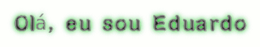

<!-- Texto Animado -->

<!DOCTYPE html>
<html lang="pt-br">
<head>
<meta charset="UTF-8">
<meta name="viewport" content="width=device-width, initial-scale=1.0">
<title>Olá, eu sou Eduardo</title>

</head>
<body>
  
Olá, eu sou Eduardo

</body>
</html>

---
<!-- Gráfico de Linguagens -->

---

<!-- Botão Instagram -->

